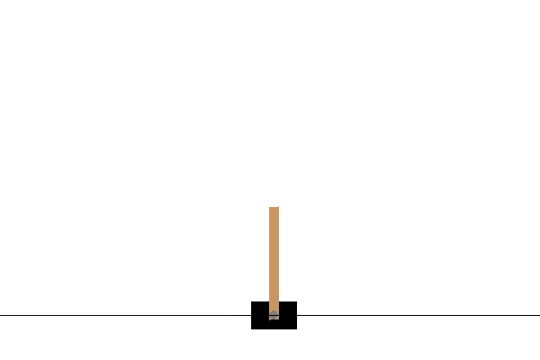

# Stable Baselines3 커스텀 환경 프로젝트

이 프로젝트는 Gymnasium API를 사용하여 직접 환경을 만들고, Stable Baselines3의 PPO 알고리즘으로 에이전트를 학습시킨 결과입니다.
액션 : 왼쪽, 오른쪽
상태 : 카트위치, 카트속도, 막대 각도, 막대 각속도

## 학습 결과

학습된 에이전트가 환경에서 임무를 수행하는 모습입니다.

## 프로젝트 구조
